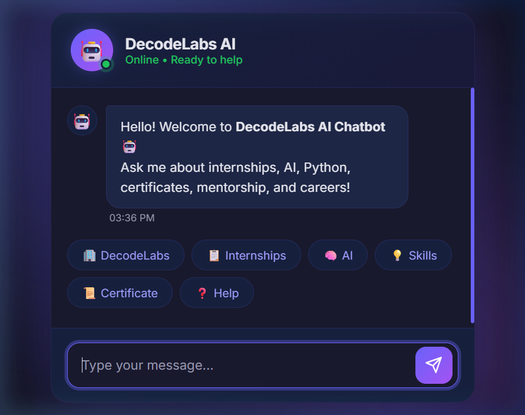
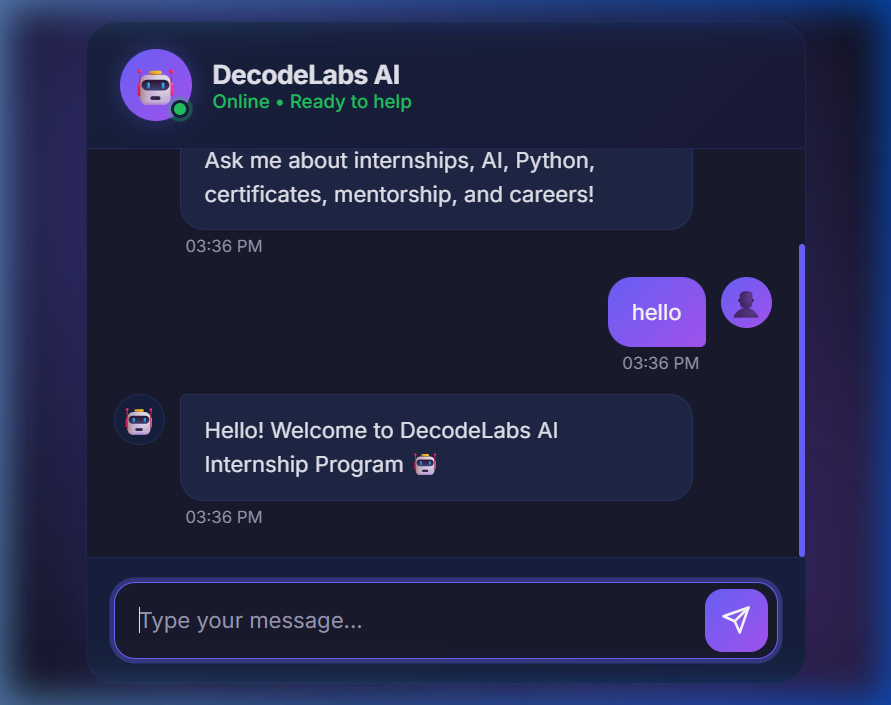
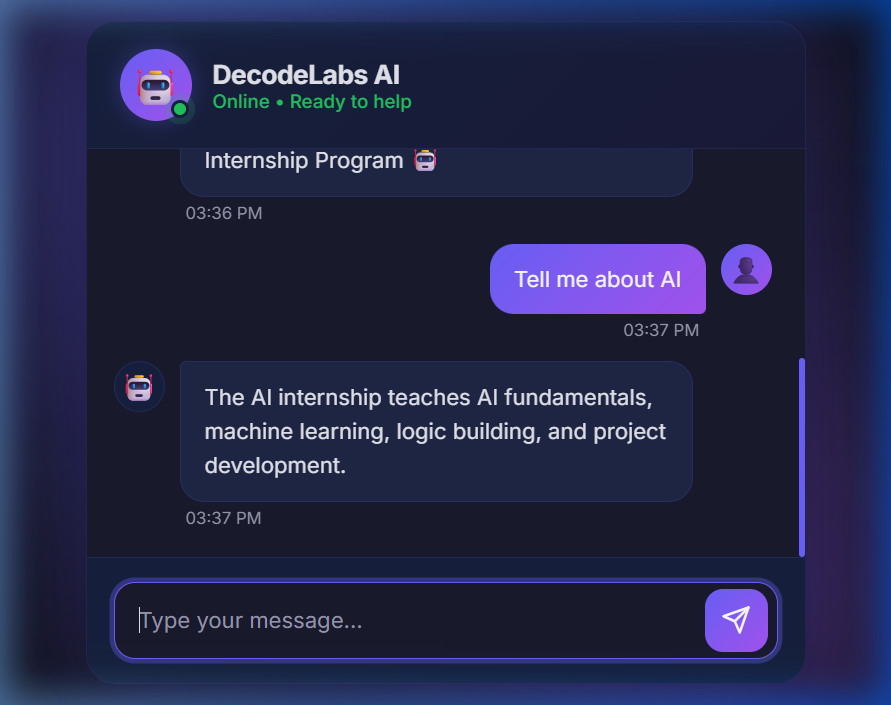

<p align="center">
  
  
  
  
</p>

# 🤖 DecodeLabs Rule-Based AI Chatbot

A simple yet attractive **rule-based chatbot** built with Python. It answers questions about **DecodeLabs internships, AI, Python, certificates, mentorship, careers**, and more — all through a beautiful dark-themed web interface.

> 🎓 Built as part of the **DecodeLabs AI Internship Program**

---

## ✨ Features

- 💬 **Instant Replies** — Rule-based responses for common queries
- 🌙 **Dark Theme UI** — Sleek interface with purple gradient accents
- ⚡ **Quick Action Chips** — One-click buttons for popular questions
- ⏳ **Typing Indicator** — Animated dots for a natural chat feel
- 🎨 **Animated Background** — Soft floating gradient blobs
- 📱 **Responsive Design** — Works on desktop and mobile

---

## 📸 Screenshots

### Welcome Screen
<p align="center">
  
</p>

### Chat in Action — Greeting
<p align="center">
  
</p>

### Chat in Action — AI Query
<p align="center">
  
</p>

---

## 🚀 How to Run

1. **Clone the repository**
   ```bash
   git clone https://github.com/asimtaseer/DecodeLabs-Internship.git
   cd "Rule Based Chat-Bot"
   ```

2. **Install Flask**
   ```bash
   pip install flask
   ```

3. **Start the server**
   ```bash
   python app.py
   ```

4. **Open your browser** and go to:
   ```
   http://127.0.0.1:5000
   ```

---

## 📁 Project Structure

```
Rule Based Chat-Bot/
├── main.py            # Original console-based chatbot
├── app.py             # Flask web server + chatbot API
├── README.md
├── screenshots/       # UI screenshots
│   ├── chat_welcome.png
│   ├── chat_hello.png
│   └── chat_ai.png
└── static/
    ├── index.html     # Chat UI
    ├── style.css      # Dark theme styling
    └── script.js      # Chat interaction logic
```

---

## 💡 Topics You Can Ask About

| Topic | Example Question |
|-------|-----------------|
| 🏢 DecodeLabs | *"What is DecodeLabs?"* |
| 📋 Internships | *"Tell me about internship"* |
| 🧠 AI | *"What is AI?"* |
| 🐍 Python | *"Tell me about Python"* |
| 📜 Certificate | *"How to get certificate?"* |
| 👨‍🏫 Mentorship | *"Do you provide mentorship?"* |
| 💼 Careers | *"How can I get a job?"* |
| ⏱️ Duration | *"How long is the internship?"* |
| 📧 Contact | *"How to contact DecodeLabs?"* |

---

## 🛠️ Tech Stack

- **Backend:** Python, Flask
- **Frontend:** HTML, CSS, JavaScript
- **Font:** [Inter](https://fonts.google.com/specimen/Inter) (Google Fonts)

---

## 👤 Author

**Asim Taseer**

[](https://linkedin.com/in/asimtaseer)

---

<p align="center">
  Made with ❤️ for the DecodeLabs AI Internship Program
</p>
